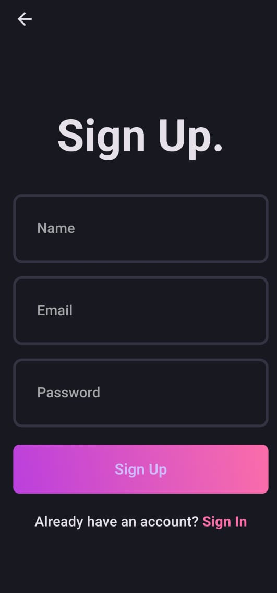
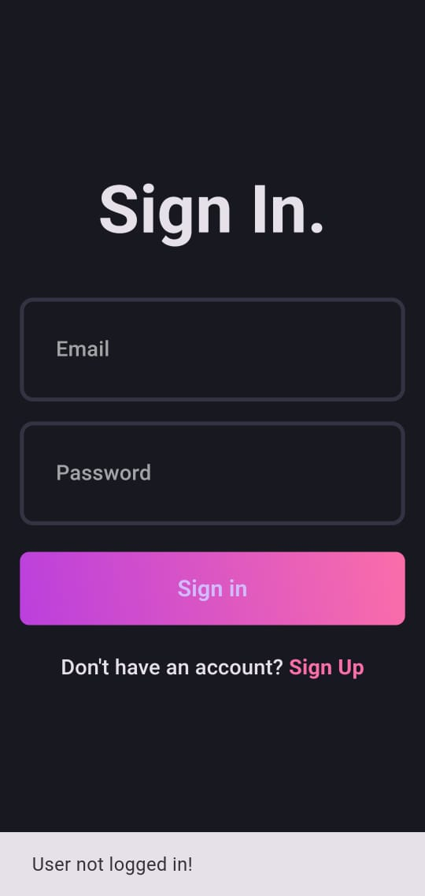
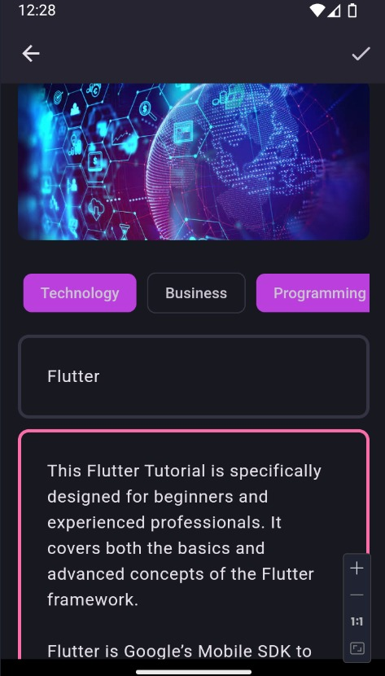
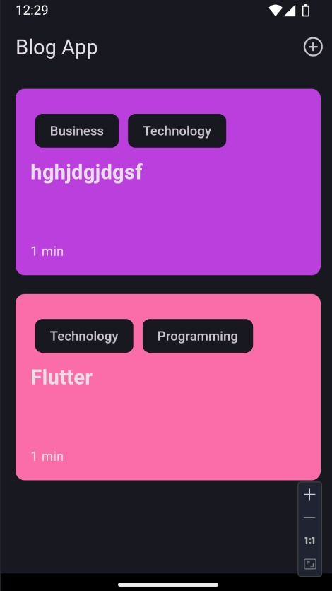
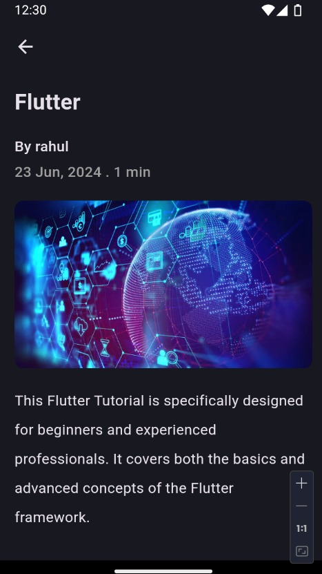

# Flutter Clean Architecture Blog App with Supabase and Hive

This Flutter project demonstrates a clean architecture approach to implementing a blog app with authentication using Supabase as the database backend and Hive for local storage. The project is organized to separate concerns and follow best practices in software architecture.

## Table of Contents

- [Features](#features)
- [Architecture Overview](#architecture-overview)
- [Prerequisites](#prerequisites)
- [Getting Started](#getting-started)
- [Project Structure](#project-structure)
- [Usage](#usage)
- [Contributing](#contributing)
- [License](#license)

## Features

- User registration
- User login
- Password recovery
- Session management
- Blog post creation
- Blog post display
- Blog post editing
- Blog post deletion
- Local data storage with Hive

## Architecture Overview

This project follows the principles of Clean Architecture, aiming to separate the business logic from the UI and data layers. The architecture is divided into three main layers:

1. **Presentation Layer**: Responsible for UI and user interaction.
2. **Domain Layer**: Contains business logic and entities.
3. **Data Layer**: Manages data sources, repositories, and local storage with Hive.

## Prerequisites

- [Flutter](https://flutter.dev/docs/get-started/install)
- [Supabase account](https://supabase.io/) and project setup
- Supabase URL and Anon Key
- [Hive](https://pub.dev/packages/hive) for local storage

## Getting Started

Follow these steps to set up and run the project on your local machine:

1. **Clone the repository**:

   ```sh
   git clone https://github.com/your-username/flutter-clean-architecture-blogApp.git
   cd flutter-clean-architecture-blog-app-supabase-hive
   ```

2. **Install dependencies**:

   ```sh
   flutter pub get
   ```

3. **Configure Supabase**:

   - Create a `.env` file in the root directory.
   - Add your Supabase URL and Anon Key to the `.env` file:
     ```
     SUPABASE_URL=https://xyzcompany.supabase.co
     SUPABASE_ANON_KEY=your-anon-key
     ```

4. **Initialize Hive**:

   - Ensure you initialize Hive in your `main.dart` file:
     ```dart
     void main() async {
       await Hive.initFlutter();
       runApp(MyApp());
     }
     ```

5. **Run the app**:

   ```sh
   flutter run
   ```

## Project Structure

```
lib/
├── main.dart                 # Entry point of the application
├── core/                     # Core utilities and constants
│   ├── error/
│   ├── usecases/
│   └── utils/
├── data/                     # Data layer: repositories and data sources
│   ├── models/
│   ├── repositories/
│   ├── datasources/
│   │   ├── remote/           # Remote data sources (Supabase)
│   │   └── local/            # Local data sources (Hive)
├── domain/                   # Domain layer: entities and use cases
│   ├── entities/
│   └── usecases/
└── presentation/             # Presentation layer: UI and state management
    ├── blocs/
    ├── pages/
    │   ├── auth/             # Authentication-related pages
    │   └── blog/             # Blog-related pages
    └── widgets/
```

### Core

Contains common utilities, constants, and error handling mechanisms.

### Data

Manages data access from Supabase and local storage with Hive. Maps data to domain entities.

### Domain

Holds the business logic, entities, and use cases.

### Presentation

Manages UI and state using Flutter's BLoC pattern.

### Screenshots











## Usage

### Authentication

#### Register a New User

To register a new user, use the registration form provided in the UI. The form will validate the input and call the registration use case.

#### Login a User

Use the login form to authenticate a user. Upon successful login, the session will be managed and persisted.

#### Password Recovery

Use the password recovery option to reset the user's password via Supabase.

### Blog App

#### Display Blog Posts

The main page displays a list of blog posts. Each post can be viewed in detail by selecting it from the list.

#### Create a New Blog Post

Use the provided form to create a new blog post. The form will validate the input and call the create post use case.

## Contributing

Contributions are welcome! Please open an issue or submit a pull request for any improvements or bug fixes.

### Steps to Contribute

1. **Fork the repository**
2. **Create a new branch**: `git checkout -b feature/my-new-feature`
3. **Commit your changes**: `git commit -m 'Add some feature'`
4. **Push to the branch**: `git push origin feature/my-new-feature`
5. **Open a pull request**

## License

This project is licensed under the MIT License - see the [LICENSE](LICENSE) file for details.
